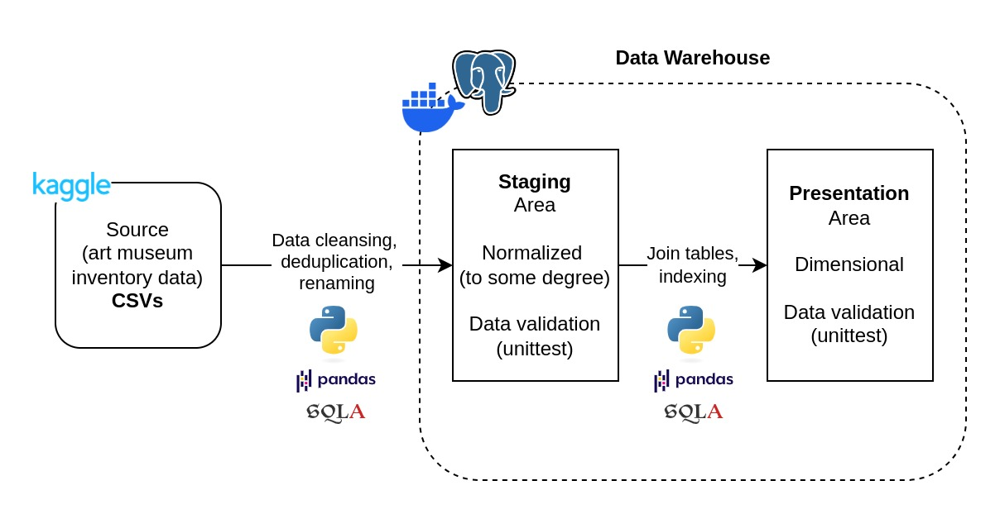

# paintings-data

<p align="center">

</p>

<p align="center">
  Woman with a Parasol – Madame Monet and Her Son, <i>1875 by Claude Monet, <br>National Gallery of Art, Washington DC</i>
</p>

This project is an ETL pipeline that ingests data on museums, artists, and their paintings into a data warehouse in Postgres. The intent here is building the data models and the ETL process from scratch, understanding these concepts by limiting the use of more sophisticated tools. It has the following features:

- Establishes an ETL process with Python using SQLAlchemy and Pandas
- Creates a data warehouse with a staging and presentation area using Postgres as the storage solution
- Validates every deployed table in the data warehouse with a comprehensive test suite

Below is a diagram that overviews the entire process.

<p align="center">

</p>

> **Note:** For more on architecture, check out the `doc` folder.

## Installation
After cloning the repo, run the following in the command line to install the required Python packages:
```
make init
```
This project also requires [PostgreSQL](https://www.postgresql.org/download/). Navigate the downloads based on your OS.

It's also recommended to install a SQL client like [pgAdmin 4](https://www.pgadmin.org/download/). We'll be mentioning pgAdmin throughout from here on.

## Usage
With PostgreSQL installed, know your user credentials. Usually the default user name and password is `postgres` (you can always [change the password](https://stackoverflow.com/questions/12720967/how-can-i-change-a-postgresql-user-password)). Then edit the `user` and `password` fields in the `pipelines/config.json` file accordingly.

To create a local database, first connect to the default `postgres` database with the `postgres` user. You can do this either through the `psql` console or pgAdmin. Then run the following query:
```
CREATE DATABASE paintings;
```


Also, remember to download the [data](https://www.kaggle.com/datasets/mexwell/famous-paintings)! Extract the `csv`'s to the `data` folder.

In order to deploy the tables, run the following commands to setup the staging and presentation area:
```
# Deploy tables to the staging area
make staging

# Deploy tables to the presentation area
make presentation
```
You should see these tables now in the ``paintings`` database. Check it out easily through pgAdmin.

To validate the tables, run the following commands:
```
make test-staging
make test-presentation
```

## Data
The data was sourced from [Kaggle](https://www.kaggle.com/datasets/mexwell/famous-paintings).


## License
This project is under the MIT license (see [LICENSE](LICENSE))
