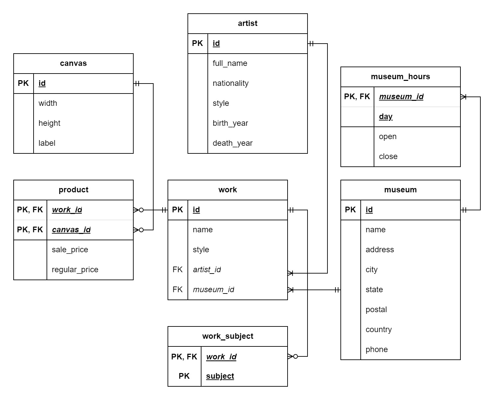
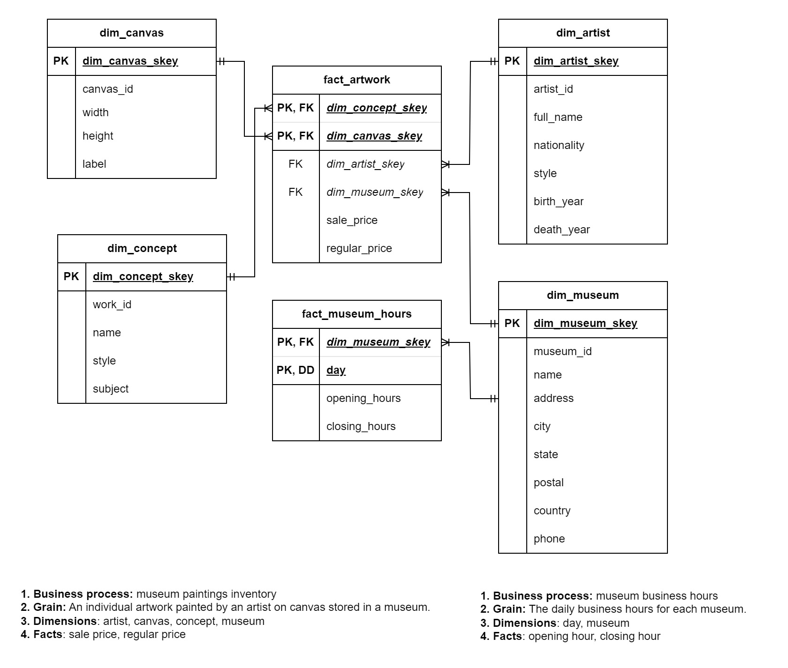

# Reference manual

This reference manual examines the data set and its patterns, the steps involved in our pipeline, and the overall structure of the data warehouse.

## Data

## Entity-relationship diagrams
### Staging Area

### Presentation Area

